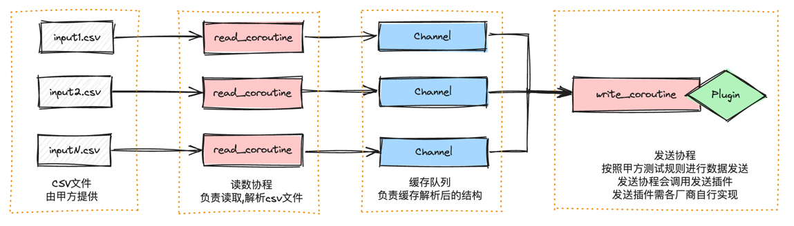
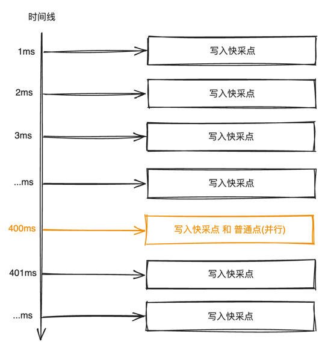

# rtdb_writer

实时/时序数据库的写入测试程序

本程序由两个部分组成: 
* 主体部分: 负责读取csv文件, 并且按照一定测试规则调用数据发送插件
* 插件部分: 由各个厂商需自己实现基于```plubin/write_plugin.h```头文件的插件

# 目录结构
```tex
.
├── CSV20240614 // 测试CSV示例文件
├── README.md   // 架构说明文档
├── plugin
│         ├── dylib.h // 内部封装了基于C的插件加载函数, 此头文件会在writer编译时编译到写数程序中
│         └── write_plugin.h // !!! 插件接口文件, 各厂商需要根据此头文件自行实现写入插件
├── plugin_example //插件示例
│         ├── Makefile
│         ├── write_plugin.c
│         └── write_plugin.h
├── resource // 资源文件, 内涵架构图, 在README.md中会被引用
│         ├── design_drawing.png
│         └── periodic_write_process.png
└── writer
    ├── build.sh // 编译脚本
    ├── main.go // 写数程序源代码
    └── 命令行示例.md // 命令行示例
```

# writer设计图


# 周期性写入, 写入流程说明


由于**快采点**和**普通点**写入周期不同, 所以开启了两个协程序分别进行**快采点**和**普通点**的写入, 在写入方面**快采点**和**普通点**互不影响.
但是由于**快采点**和**普通点**共用一个插件, 所以要求在插件实现的写入接口是可重入的. 

# 编译说明
1. 下载golang编译器: https://golang.google.cn/
2. 运行编译脚本: ```./writer/build.sh```
3. 阅读命令行示例: ```./writer/命令行示例.md```

备注: 命令行示例.md 在```./writer```目录下可直接运行